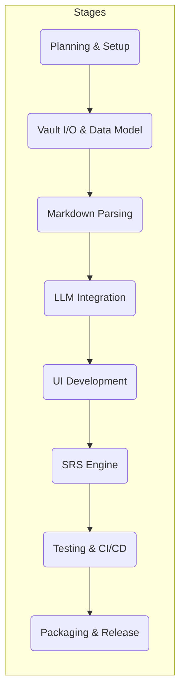

# Executive Summary  
This plan outlines a **multi-stage implementation** for an Electron-based AI-enhanced Obsidian knowledge app. The project is divided into phases with clear **milestones, deliverables, durations, dependencies, roles, risks,** and **acceptance criteria**. Key technical workstreams include setting up Electron and file I/O, designing the Markdown/block data model, integrating LLM services (Ollama/OpenAI), building spaced-repetition logic, and developing UI components (DailyNoteEditor, BlockViewer, Settings). We recommend an MVP focusing on core note-taking, AI-assisted entry refinement, and basic review scheduling; post-MVP features include advanced analytics, syncing, and UI polish. The detailed Gantt-style timeline and a dependency flowchart below break out work by weeks. References guide technical decisions (e.g. Obsidian comment syntax【8†L167-L170】, File System Access API【43†L259-L261】, LLM SDKs【16†L280-L289】【19†L109-L118】, and SRS algorithms【29†L386-L389】).

## Project Stages & Timeline  

| Stage | Duration (weeks) | Dependencies | Milestones / Deliverables                                                                                             |
|-------|------------------|--------------|----------------------------------------------------------------------------------------------------------------------|
| **1. Planning & Setup**    | 1–2  | – | **Milestone:** Project kickoff complete; dev environment configured. **Deliverables:** Architecture docs, Electron skeleton app. |
| **2. Vault I/O & Data Model** | 2–3  | 1 | **Milestone:** Local vault read/write working. **Deliverables:** JSON schema (index.json), file API module (using Node FS or FileSystem API【43†L259-L261】). |
| **3. Markdown Parsing & Comments** | 2–3  | 2 | **Milestone:** Knowledge blocks can be extracted/inserted into notes. **Deliverables:** Markdown parser with heading/comment extraction (Obsidian comments use `%%...%%`【8†L167-L170】); index update logic. |
| **4. LLM Integration Layer** | 3–4  | 1,2 | **Milestone:** AI service endpoints functional. **Deliverables:** LLM service (Ollama HTTP client and/or OpenAI Node SDK integration【16†L280-L289】【19†L109-L118】), prompting logic, API key/config UI. |
| **5. UI Components Development** | 3–4  | 2,3,4 | **Milestone:** Major UI flows implemented. **Deliverables:** React/Vue components for Daily Note Editor (with tag input【56†L1-L5】), Block Viewer (interactive Q/A), Settings panel. LLM prompts integrated into form actions. |
| **6. SRS Engine & Scheduling** | 2–3  | 3,4,5 | **Milestone:** Review scheduling functional. **Deliverables:** Implementation of spaced-repetition (SM-2 or FSRS-6 algorithm【29†L386-L389】), scheduling service, integration with index, “due today” list. |
| **7. Testing & CI/CD**      | 2    | 3–6 | **Milestone:** Test coverage and build pipeline ready. **Deliverables:** Automated unit/integration tests, CI config, continuous builds. |
| **8. Packaging & Release**  | 1–2  | 1–7 | **Milestone:** MVP release. **Deliverables:** Electron-builder packages for target OSes, user documentation, deployment guides. |

**Gantt Timeline (weeks vs stages):**

| Stage / Week            | 1 | 2 | 3 | 4 | 5 | 6 | 7 | 8 | 9 |10|11|12|13|14|15|16|17|
|-------------------------|---|---|---|---|---|---|---|---|---|--|--|--|--|--|--|--|--|
| Planning & Setup        | ■ | ■ |   |   |   |   |   |   |   |  |  |  |  |  |  |  |  |
| Vault I/O & Data Model  |   | ■ | ■ | ■ |   |   |   |   |   |  |  |  |  |  |  |  |  |
| Markdown Parsing        |   |   | ■ | ■ | ■ |   |   |   |   |  |  |  |  |  |  |  |  |
| LLM Integration         |   |   |   | ■ | ■ | ■ |   |   |   |  |  |  |  |  |  |  |  |
| UI Components           |   |   |   |   | ■ | ■ | ■ |   |   |  |  |  |  |  |  |  |  |
| SRS Engine              |   |   |   |   |   | ■ | ■ | ■ |   |  |  |  |  |  |  |  |  |
| Testing & CI/CD         |   |   |   |   |   |   | ■ | ■ |   |  |  |  |  |  |  |  |  |
| Packaging & Release     |   |   |   |   |   |   |   | ■ | ■ | ■|  |  |  |  |  |  |  |
(■ = active)

## Stage Details

### Stage 1: Planning & Setup (1–2 weeks)  
**Activities:** Define system architecture, tech stack (Electron+Node+React, TypeScript). Set up project repo and tools (Git, CI). Create initial Electron boilerplate.  
**Team:** 1 Project Manager (PM), 1 Tech Lead, 1 DevOps.  
**Deliverables:** Architecture and UX designs; Electron skeleton app initializing on launch.  **Acceptance:** Electron app builds/runs on at least one OS; folder selection UI appears.  
**Risks:** Ambiguous requirements; mitigate by stakeholder reviews. Electron compatibility issues; mitigate by testing on major OS.  

### Stage 2: Vault I/O & Data Model (2–3 weeks)  
**Activities:** Design `index.json` schema for blocks, including fields (ID, tags, file path, review metadata). Implement file I/O module to open vault directory and read/write notes. Use Node `fs` or Chrome File System Access API【43†L259-L261】. Handle permission persistence.  
**Team:** 1 Backend Dev, 1 PM (oversight).  
**Deliverables:** `vaultService` with functions: `openVault(path)`, `readNote(file)`, `writeNote(file)`, `updateIndex()`.  **Acceptance:** Can select a vault and list its files; writing to a test markdown file succeeds (confirm via file system).  
**Dependencies:** Stage 1.  
**Risks:** Permission/API issues (e.g. on macOS with Node FS vs browser API); mitigate with testing.  

### Stage 3: Markdown Parsing & Comments (2–3 weeks)  
**Activities:** Use a Markdown parser to split a daily note into blocks. Extract block content, tags (with `#` prefix【56†L1-L5】), and any `%%...%%` hidden sections. Insert blocks into topic files: for each block, append to an existing note or create new (based on tags). Store memory tricks as `%%comment%%`【8†L167-L170】. Update `index.json` with new entries.  
**Team:** 1 Backend Dev, 1 Frontend Dev (for integration).  
**Deliverables:** `parserService`: functions `splitDailyNote()`, `mergeBlock()`. Endpoints for “Save Daily Note” action.  **Acceptance:** Entering a mock daily note with two blocks results in two updates to the vault (new/updated files) with correct `%%...%%` comments and JSON entries.  
**Dependencies:** Stage 2.  
**Risks:** Edge cases in parsing (YAML frontmatter, complex Markdown). Use existing libraries (e.g. `remark` or `markdown-it`). Ensure comments do not display (Obsidian hides `%%...%%`【8†L167-L170】).  

### Stage 4: LLM Integration Layer (3–4 weeks)  
**Activities:** Implement an LLM client: for Ollama, call its local HTTP API; for OpenAI, use Node SDK【16†L280-L289】. Build prompts for refining blocks and for review assistance. Ensure safe handling of user input.  
**Team:** 1 AI Engineer, 1 Backend Dev.  
**Deliverables:** `llmService` with methods `refineKnowledge(text)`, `checkAnswer(prompt, answer)`. Configuration UI for API keys or model selection. **Acceptance:** Connecting to a local Ollama model returns a valid response; a sample prompt (e.g. “Rewrite this theorem to clarify meaning”) returns intelligible output.  
**Dependencies:** Stages 1–2.  
**Risks:** Model misbehavior or sensitive data leaks. Mitigation: filter outputs, limit code execution, use prompts that avoid hallucination. Test with known inputs.  

### Stage 5: UI Components Development (3–4 weeks)  
**Activities:** Build React/Vue components:
- **DailyNoteEditor:** Form with fields: Tags (autocomplete), Content, Memory Tricks (QA pairs, hint, cloze). Buttons to call `llmService`.
- **BlockViewer:** Lists blocks in current note, shows each question/hint, input for user response, feedback from LLM if incorrect.
- **Settings:** Select vault path, LLM settings, retention rate.  
Use design patterns for readability.  
**Team:** 1 Frontend Dev, 1 UI/UX Designer, 1 Backend Dev.  
**Deliverables:** Interactive screens. The DailyNoteEditor allows adding tags (Obsidian-style `#tag`【56†L1-L5】) and invoking LLM refinement. **Acceptance:** Manually enter a knowledge item and click “Save”; verify it appears in vault files correctly via Stage 3 logic. Review interface lets user answer a question and see correct answer.  
**Dependencies:** Stages 2–4.  
**Risks:** Unintuitive UX or slow performance. Mitigation: usability testing, virtualize long lists, simplify initial UI for MVP.  

### Stage 6: SRS Engine & Scheduling (2–3 weeks)  
**Activities:** Implement a spaced-repetition algorithm. For MVP, SM-2 (Anki) suffices, but consider FSRS-6 model【29†L386-L389】 for future. Code scheduling logic that updates `familiarity`, `next_review`. Add daily agenda feature.  
**Team:** 1 Backend Dev, 1 Data Scientist (optional).  
**Deliverables:** `srsService`: `scheduleReviews()`, `updateCardPerformance()`. Dashboard listing due blocks. **Acceptance:** On simulation, a card reviewed “correct” is scheduled farther out; an incorrect review resets sooner. E.g. test with sample retention curves.  
**Dependencies:** Stage 3.  
**Risks:** Complexity of FSRS; mitigate by starting with proven SM-2 algorithm, later tuning for FSRS as data grows.  

### Stage 7: Testing & CI/CD (2 weeks)  
**Activities:** Write automated tests (unit and integration) for each module: vault I/O, parser, LLM stubs, SRS logic. Set up CI (GitHub Actions or similar) to run tests on commit. Include code linting and security scans.  
**Team:** 1 QA/Test Engineer, 1 DevOps.  
**Deliverables:** Test suites and passing CI pipeline. **Acceptance:** ≥80% code coverage on core modules; CI pipeline green for all commits.  
**Dependencies:** All prior stages.  
**Risks:** Flaky tests, integration issues. Use mock objects for LLM and file operations to stabilize tests.  

### Stage 8: Packaging & Release (1–2 weeks)  
**Activities:** Configure `electron-builder` for target platforms (Windows, macOS, Linux). Code-signing (if needed), auto-update channels. Prepare user documentation.  
**Team:** 1 DevOps, 1 Technical Writer.  
**Deliverables:** Installable application packages, release notes, user guide. **Acceptance:** A user can download and install the app on at least one OS and run it. All major functions (daily note creation, review) work without developer tools open.  
**Dependencies:** All prior stages.  
**Risks:** Platform-specific bugs. Early test on each OS; use cross-platform Electron APIs only.  

## MVP Scope and Roadmap  

- **MVP:** Core note-taking (daily notes, block creation), basic AI-assisted refinement, simple review scheduling, and Vault integration. No fancy UI features, minimal analytics.  
- **Post-MVP Features:** Enhanced SRS (FSRS-6 tuning), synced cloud backup, offline-first improvements, advanced query/search, graph views of topics, mobile support, plugins/extensions.  

## Team Roles & FTE Estimates  

| Role            | Responsibilities                                   | Estimated Effort (FTE)             |
|-----------------|-----------------------------------------------------|------------------------------------|
| Project Manager (PM) | Coordination, milestones, stakeholder management | 0.1 (part-time) throughout         |
| Tech Lead       | Architecture oversight, code reviews               | 0.2                                |
| Backend Developer | File I/O, parsing, LLM integration, SRS logic   | 1.0 for Stages 2–6, 0.5 thereafter |
| Frontend Developer| UI components, integration, styling             | 1.0 for Stages 5–7                 |
| AI/ML Engineer  | LLM prompts, integration, data modeling           | 0.5 for Stage 4, 0.2 for Stage 6   |
| QA/Test Engineer| Automated tests, QA strategy                      | 0.5 for Stage 7                    |
| DevOps Engineer | CI/CD pipeline, packaging, deployment             | 0.3 for Stages 1,7,8               |
| UX/UI Designer  | Wireframes, user experience design                | 0.3 for Stage 5                    |
| Technical Writer| Documentation, release notes                       | 0.2 in Stage 8                     |

*Assumptions:* Cross-functional team; actual headcount unspecified. FTE sums indicate cumulative effort per stage.

## Risk Matrix  

| Risk                  | Likelihood | Impact | Mitigation                                                      |
|-----------------------|------------|--------|-----------------------------------------------------------------|
| File API Incompatibility | Medium   | High   | Test on all target OS; use Electron’s Node FS or polyfills【43†L259-L261】 |
| LLM Reliability/Safety  | Medium   | Medium | Use prompt engineering, content filters; fallback messages on failure |
| Scope Creep           | High     | Medium | Freeze MVP features early; prioritize backlog.                  |
| Scheduling Complexity | Low      | Low    | Start with SM-2 then iterate to FSRS; use libraries if available【29†L386-L389】 |
| Team Turnover         | Low      | High   | Document design; overlap critical knowledge among members.      |
| UI/UX Issues          | Medium   | Medium | Early user testing on prototypes; iterate designs.             |

## Sources  

- Obsidian Help – Comments syntax (use `%%` for hidden text)【8†L167-L170】; Tags (prefix with `#`)【56†L1-L5】.  
- MDN Web Docs – File System Access API (directory handles in IndexedDB)【43†L259-L261】.  
- Ollama Docs – Running local LLMs via HTTP (see example Node fetch code)【19†L109-L118】.  
- OpenAI Node Quickstart – Using OpenAI’s Node SDK for chat completions【16†L280-L289】.  
- Hugging Face JS – Inference client library for calling models【21†L190-L199】.  
- FSRS Resources – Modern SRS algorithms (FSRS-6 used in Obsidian plugins)【29†L386-L389】.  

